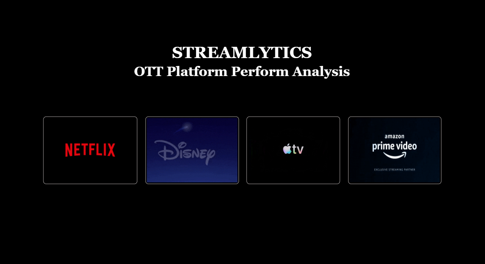
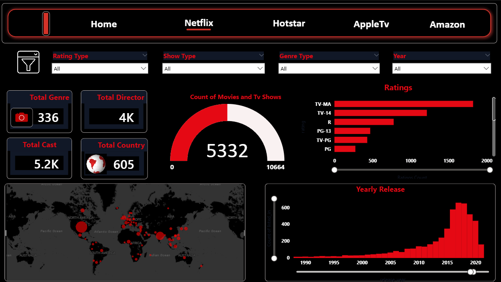
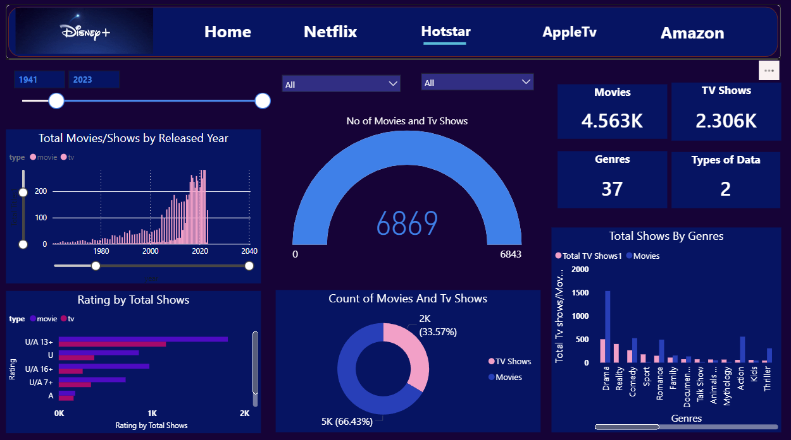
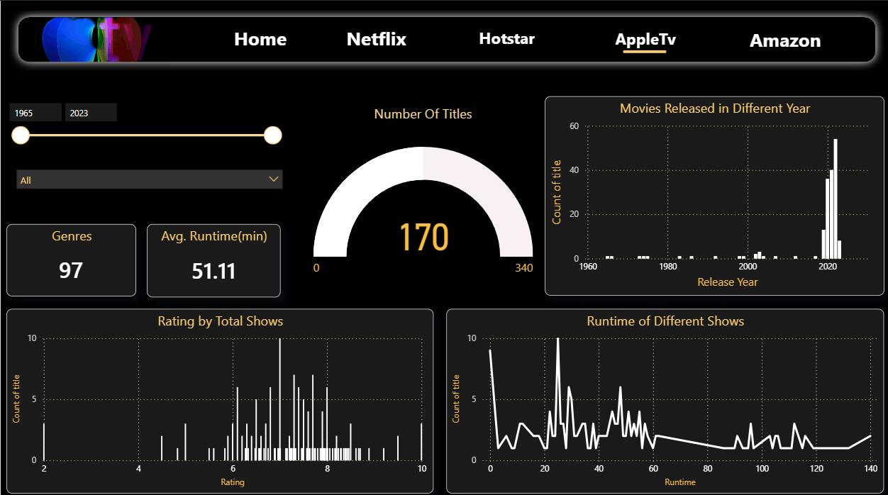
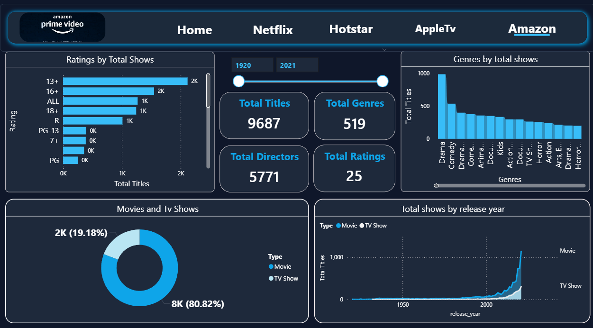

# STREAMLYTICS – OTT Platform Performance Analysis

## Project Overview
This project presents an interactive Power BI dashboard for analyzing OTT platform performance across major streaming platforms including Netflix, Hotstar, Apple TV, and Amazon Prime.

The dashboard provides comparative insights into content distribution, ratings, genres, release trends, and platform-wise performance using interactive visualizations.

## Objectives
- Analyze OTT platform performance
- Compare streaming services
- Identify content distribution trends
- Generate business insights using data visualization

## Tools & Technologies Used
- Power BI
- Excel / CSV
- Data Cleaning
- Data Visualization

## Platforms Analyzed
- Netflix
- Hotstar
- Apple TV
- Amazon Prime

## Dashboard Features
✔ Interactive filters  
✔ KPI cards and visual insights  
✔ Platform-wise comparison  
✔ Genre and rating analysis  
✔ Release year trend analysis  
✔ Business intelligence dashboard  

## Dashboard Preview

### Home Dashboard

### Netflix Dashboard

### Hotstar Dashboard

### Apple TV Dashboard

### Amazon Prime Dashboard

## Key Insights
- Netflix contains the highest content availability
- Prime Video shows wide content diversity
- Apple TV focuses on limited premium content
- Hotstar provides strong regional and TV-based content

## Future Improvements
- Real-time OTT analytics
- Viewer engagement analysis
- Predictive trend analysis
- Subscription growth forecasting

## Author
Alfiya Fathima S
